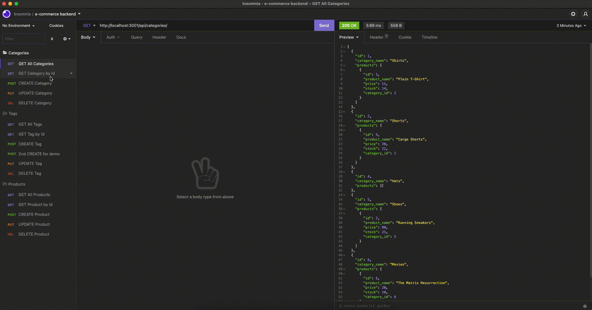

# e-commerce-backend
[](./LICENSE)
## Description
This app is the backend of an e-commerce store. Built with Express, MySQL2, and Sequelize.

## User Story
```
As a manager at an internet retail company, I want a back end for my e-commerce website that uses the latest technologies so that my company can compete with other e-commerce companies.
```

## Table of Contents
- [Installation](#installation)
- [Usage](#usage)
- [License](#license)
- [Features](#features)
- [Tests](#tests)
- [Questions](#questions)

## Installation
- To get the app on your local machine:
  1. Click on the code button on the repo.
  2. Copy the HTTPS or SSH link.
  3. Run the command `git clone` with the copied HTTPS or SSH link.
- To get the app prepared to run:
  1. In your local repo, open the `.env` file and fill in the fields with your mysql login information.
  2. In the terminal, run the command `npm i`, then run `mysql -u root -p`.
  3. After logging into MySQL, run the command `source db/schema.sql`, then run `quit`.
- If you would like seed data for testing, run the command `npm run seed`.

## Usage
The visual shows the app running on a local server and how request are made using Insomnia.



Please click [here](https://youtu.be/GuUCvJOx9C4) for a video demo.

## License
This application is covered under the MIT license.

## Features
- Retrieve list of categories, products, or product tags
- Retrieve an individual category, product, or product tag
- Add a category, product, or product tag to their respective lists
- Update a category, product, or product tag
- Ability to link multiple tags to multiple products and also link multiple products to a category which will be shown when retrieving the category, product, or product tag data
- Delete a category, product, or product tag from their respective lists

## Tests
As shown in the video demo, the command `npm start` was run to start the app.

Once the server has started on a local server, GET, POST, PUT, and DELETE requests were input into Insomnia at the Category routes, Tag routes, and Product routes.

## Questions
To view more of my projects, you can visit my GitHub page at [andrewbyoo](https://github.com/andrewbyoo).
If you have questions, email me at [andrewbyoo@gmail.com](mailto:andrewbyoo@gmail.com).
